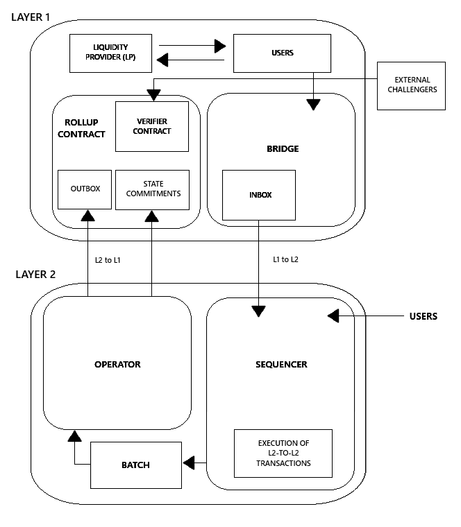

# Ethereum Rollups: Layer 2 Solutions for Scalability

## Overview

This final thesis titled **"Ethereum Rollups: Layer 2 Solutions for Scalability"** explores the scalability challenges of Ethereum and analyzes **Optimistic Rollups** as a promising Layer 2 solution to the blockchain trilemma.

The work includes both theoretical and experimental analysis, comparing testnets such as **Optimism** and **Arbitrum** using real-world scenarios and performance metrics.

## Objectives

- Understand the blockchain scalability trilemma (scalability, security, decentralization)
- Study different Layer 2 approaches (State Channels, Plasma, Optimistic Rollups, ZK-Rollups)
- Implement and test Layer 2 solutions using public testnets
- Analyze performance, costs and throughput
- Document technical and architectural insights

## Technologies & Tools

- Ethereum
- Solidity
- Optimism & Arbitrum testnets
- Sepolia (Layer 1)
- Metamask
- Etherscan
- Go (Optimism stack components)

## Architecture Overview

To better understand the system, I created the following image to represent the general topology of a rollup architecture within the Ethereum ecosystem.

---

## Acknowledgements

Special thanks to **Jesús Correas Fernández** for his support, guidance and dedication throughout the project.

---

## Author

**Javier Jerez Reinoso**
> Feel free to reach out if you would like to discuss about Ethereum, Layer 2 scalability or blockchain infrastructure

javjerez.r@gmail.com

[LinkedIn](https://www.linkedin.com/in/javier-jerez-reinoso)
